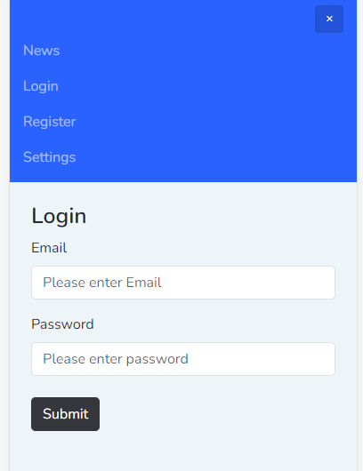

# Installation

To set up this project, follow the steps below:

## Backend

1. Pull the code from the repository.
2. Run Docker Compose to start the containers:

   ```bash
   docker-compose up
   ```

3. Access the PHP container:

   ```bash
   docker exec -it php-container-name /bin/sh
   ```

4. Inside the PHP container, run Composer to install dependencies:

   ```bash
   composer install
   ```

4. Create env file:

   ```bash
   cp .env.example .env
   ```
   
5. Run database migrations:

   ```bash
   php artisan migrate
   ```

6. Fetch data:

   ```bash
   php artisan app:fetch-news
   ```  

## Frontend

1. Access the React container:

   ```bash
   docker exec -it react-container-name /bin/sh
   ```

2. Inside the React container, start the development server:

   ```bash
   npm install
   ```
   
   ```bash
   npm start
   ```

3. Access the application through your web browser at:

   [http://localhost:80](http://localhost:80)

# To-Do (Improvements)

Here are some improvements you can consider for this project:

- Implement proper pagination.
- Add more tests.
- Integrate composer and npm into Dockerfile, there was a bug I didn't figure out

Feel free to contribute and make these improvements to enhance the project further.

# Screenshots

Here are some screenshots of the application:




